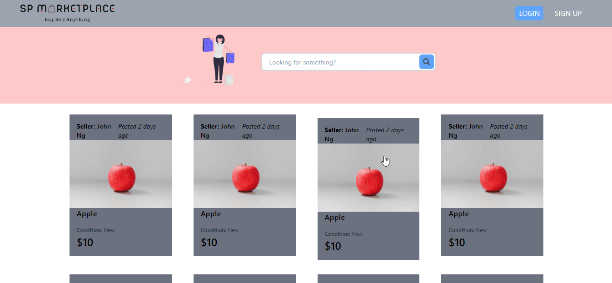

# Install Instruction

## Clone this repo:

- See client/ folder for instructions
- See server/ folder for instructions

# Mini MarketPlace

**You are required to build a mini online marketplace web platform for buying and selling products from end-users. The application should consist of a frontend and backend Restful web services using the Node, Express, React JS & MySQL stack.**

### Requirements

You are required to fulfil the following requirements:

- Front-end for the web application (You are allowed to use open source templates downloaded from the Internet)

- Persistent login (and logout)

- Add product listing

- View own listed products

- Search products listed by other users

Please also produce documentation indicating the Web service API listings, Database relationship and setup instructions.
